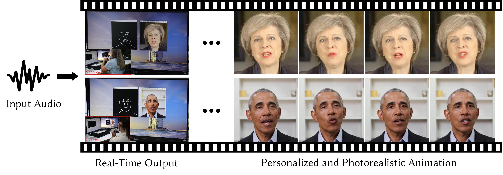

# [COLAB LINK](https://colab.research.google.com/drive/1fTBy6fRyBFtgCHxcrU-9EnvjgD128Z-8#scrollTo=dzQ9HSXkm-WV)

# Live Speech Portraits: Real-Time Photorealistic Talking-Head Animation

This repository contains the implementation of the following paper:

> **Live Speech Portraits: Real-Time Photorealistic Talking-Head Animation**
>
> Yuanxun Lu, [Jinxiang Chai](https://scholar.google.com/citations?user=OcN1_gwAAAAJ&hl=zh-CN&oi=ao), [Xun Cao](https://cite.nju.edu.cn/People/Faculty/20190621/i5054.html) *(SIGGRAPH Asia 2021)*
>
> **Abstract**: To the best of our knowledge, we first present a live system that generates personalized photorealistic talking-head animation only driven by audio signals at over 30 fps. Our system contains three stages. The first stage is a deep neural network that extracts deep audio features along with a manifold projection to project the features to the target person's speech space. In the second stage, we learn facial dynamics and motions from the projected audio features. The predicted motions include head poses and upper body motions, where the former is generated by an autoregressive probabilistic model which models the head pose distribution of the target person. Upper body motions are deduced from head poses. In the final stage, we generate conditional feature maps from previous predictions and send them with a candidate image set to an image-to-image translation network to synthesize photorealistic renderings. Our method generalizes well to wild audio and successfully synthesizes high-fidelity personalized facial details, e.g., wrinkles, teeth. Our method also allows explicit control of head poses. Extensive qualitative and quantitative evaluations, along with user studies, demonstrate the superiority of our method over state-of-the-art techniques.
>
> [[Project Page]](https://yuanxunlu.github.io/projects/LiveSpeechPortraits/)    [[Paper]](https://yuanxunlu.github.io/projects/LiveSpeechPortraits/resources/SIGGRAPH_Asia_2021__Live_Speech_Portraits__Real_Time_Photorealistic_Talking_Head_Animation.pdf)    [[Arxiv]](https://arxiv.org/abs/2109.10595)    [[Web Demo]](https://replicate.ai/yuanxunlu/livespeechportraits)


Figure 1. Given an arbitrary input audio stream, our system generates personalized and photorealistic talking-head animation in real-time. Right: May and Obama are driven by the same utterance but present different speaking characteristics.


## Requirements

- This project is successfully trained and tested on Windows10 with PyTorch 1.7 (Python 3.6).  Linux and lower version PyTorch should also work (not tested). We recommend creating a new environment:

```
conda create -n LSP python=3.6
conda activate LSP
```

- Clone the repository:

```
git clone https://github.com/YuanxunLu/LiveSpeechPortraits.git
cd LiveSpeechPortraits
```

- FFmpeg is required to combine the audio and the silent generated videos. Please check [FFmpeg](http://ffmpeg.org/download.html) for installation. For Linux users,  you can also:

```
sudo apt-get install ffmpeg
```

- Install the dependences:

```
pip install -r requirements.txt
```


## Demo

- Download the pre-trained models and data from [Google Drive](https://drive.google.com/drive/folders/1sHc2xEEGwnb0h2rkUhG9sPmOxvRvPVpJ?usp=sharing) to the `data` folder.  Five subjects data are released (May, Obama1, Obama2, Nadella and McStay).

- Run the demo:

  ```
  python demo.py --id May --driving_audio ./data/Input/00083.wav --device cuda
  ```

  Results can be found under the `results` folder.


## Colab Implementation
[COLAB LINK](https://colab.research.google.com/drive/1fTBy6fRyBFtgCHxcrU-9EnvjgD128Z-8#scrollTo=dzQ9HSXkm-WV)

### Setup
```
1. Download the GitHub repository as a ZIP file to your local machine.
2. Download the datasets from Google Drive.
3. Copy the dataset folder to the `data` folder in the downloaded repository.
4. Upload this code to your Google Drive.
5. Mount the folder containing this code to Google Colab.
6. Open the provided notebook in Google Colab.
7. In the top panel, go to `Runtime` -> `Change runtime` -> Make sure T4 GPU is selected.
8. Run each block in the notebook one by one.
9. The output will be saved in the `results` folder.

Follow the steps provided in the Colab notebook for seamless execution.
```

## Local Implementation

### Environment Setup

1. Create the environment:
```
conda create -n LSP python=3.10.12
conda activate LSP
```

2. Install the necessary packages:
```

pip install librosa==0.10.1,
conda install numba==0.59.1,
pip install scikit_image==0.19.3,
pip install opencv-python==4.8.0.76,
pip install scipy==1.11.4,
pip install dominate==2.9.1,
pip install albumentations==0.5.2,
pip install numpy==1.25.2,
pip install beautifulsoup4==4.12.3,
conda install cudatoolkit,
pip install torch==2.2.1+cu121,
pip install h5py==3.9.0,
conda install -c conda-forge ffmpeg,

```

  
## Demo

- Download the pre-trained models and data from [Google Drive](https://drive.google.com/drive/folders/1sHc2xEEGwnb0h2rkUhG9sPmOxvRvPVpJ?usp=sharing) to the `data` folder.  Five subjects data are released (May, Obama1, Obama2, Nadella and McStay).

- Run the demo:

  ```
  python demo.py --id May --driving_audio ./data/Input/00083.wav --device cuda
  ```

  Results can be found under the `results` folder.

## Web App

- Clone the git repository
- Install the node modules for Backend
  ```
  cd backend
  npm install
  ```
- Install the node modules for FrontEnd (React)
  ```
  cd live-speech-portraits
  npm install
  ```
- Start the server
  ```
  cd backend
  node server.js
  ```
- Start the react app
  ```
  cd live-speech-portraits
  npm start
  ```
- Navigate to Speech Option on Navbar
- Select a Pre trained model from the dropdown (May, Obama1, Obama2, Nadella, McStay)
- Record or upload audio
- Click submit to generate the video with the input audio
- Navigate to Results Option on Navbar to see the generated output video.


## Model Conversion to Core ML models

Involves two steps:

**1. Extract PyTorch Model’s TorchScript Representation Using JIT Tracer:**
   The first step is to generate a TorchScript version of the PyTorch model. This is a way to create optimizable and serializable models using PyTorch code. TorchScript representation can be obtained using PyTorch’s JIT tracer.
   
**2. Convert the Traced PyTorch Model to Core ML Model:**
  Finally, the traced model can be converted to the Core ML model using the Unified Conversion API’s convert() method. 

##Code

---
import torch
import coremltools as ct
import sys
sys.path.append('/content/drive/MyDrive/LiveSpeechPortraits')  # Replace '/path/to/options' with the actual path to the directory containing the 'options' module

from options.test_audio2feature_options import TestOptions as FeatureOptions

# Define the path for the pre-trained model weights
model_weights_path = "/content/drive/MyDrive/LiveSpeechPortraits/data/May/checkpoints/Audio2Feature.pkl"

# Parse the options
Featopt = FeatureOptions().parse()

# Load the entire model directly from the .pkl file using torch.load()
loaded_model_state_dict = torch.load(model_weights_path, map_location=torch.device('cpu'))

# Create a generic torch.nn.Module instance
class MyModel(torch.nn.Module):
    def _init_(self):
        super(MyModel, self)._init_()

    def forward(self, x):
        return x

# Create the model instance
from models.audio2feature import Audio2Feature
Audio2Feature = MyModel()

# Load weights into the model
with torch.no_grad():
    for name, param in Audio2Feature.named_parameters():
        param.copy_(loaded_model_state_dict[name])

# Set the model to evaluation mode
Audio2Feature.eval()

# Create an example input tensor (adjust the shape based on your input)
example_input = torch.randn(1, 512, 80)

# Trace the model
traced_model = torch.jit.trace(Audio2Feature, example_input)

# Convert using Unified Conversion API
# Optionally set minimum deployment target for older devices
mlmodel = ct.convert(
    traced_model,
    inputs=[ct.TensorType(shape=example_input.shape)],
    # minimum_deployment_target="ios13"  # Uncomment and set your target version if needed
)

# Define the path for saving the Core ML model
coreml_model_path = "/content/drive/MyDrive/LiveSpeechPortraits/data/May"

# Save the Core ML model
mlmodel.save(coreml_model_path)

print("Core ML model conversion successful!")
---

---
# Convert the Audio2Headpose model as core ML model.
import torch
import coremltools as ct
import sys
sys.path.append('/content/drive/MyDrive/LiveSpeechPortraits')  # Replace '/path/to/options' with the actual path to the directory containing the 'options' module

from options.test_audio2headpose_options import TestOptions as FeatureOptions

# Define the path for the pre-trained model weights
model_weights_path = "/content/drive/MyDrive/LiveSpeechPortraits/data/May/checkpoints/Audio2Headpose.pkl"

# Parse the options
Featopt = FeatureOptions().parse()

# Load the entire model directly from the .pkl file using torch.load()
loaded_model_state_dict = torch.load(model_weights_path, map_location=torch.device('cpu'))

# Create a generic torch.nn.Module instance
class MyModel(torch.nn.Module):
    def _init_(self):
        super(MyModel, self)._init_()

    def forward(self, x):
        return x

# Create the model instance
from models.audio2headpose import Audio2Headpose
Audio2Headpose = MyModel()

# Load weights into the model
with torch.no_grad():
    for name, param in Audio2Headpose.named_parameters():
        param.copy_(loaded_model_state_dict[name])

# Set the model to evaluation mode
Audio2Headpose.eval()

# Create an example input tensor (adjust the shape based on your input)
example_input = torch.randn(1, 512, 80)

# Trace the model
traced_model = torch.jit.trace(Audio2Headpose, example_input)

# Convert using Unified Conversion API
# Optionally set minimum deployment target for older devices
mlmodel = ct.convert(
    traced_model,
    inputs=[ct.TensorType(shape=example_input.shape)],
    # minimum_deployment_target="ios13"  # Uncomment and set your target version if needed
)

# Define the path for saving the Core ML model
coreml_model_path = "/content/drive/MyDrive/LiveSpeechPortraits/coreml"

# Save the Core ML model
mlmodel.save(coreml_model_path)

print("Core ML model conversion successful!")
---

---
# Convert the Feature2Face model as core ML model.
import torch
import coremltools as ct
import sys
sys.path.append('/content/drive/MyDrive/LiveSpeechPortraits')  # Replace '/path/to/options' with the actual path to the directory containing the 'options' module

from options.test_feature2face_options import TestOptions as FeatureOptions

# Define the path for the pre-trained model weights
model_weights_path = "/content/drive/MyDrive/LiveSpeechPortraits/data/May/checkpoints/Feature2Face.pkl"

# Parse the options
Featopt = FeatureOptions().parse()

# Load the entire model directly from the .pkl file using torch.load()
loaded_model_state_dict = torch.load(model_weights_path, map_location=torch.device('cpu'))

# Create a generic torch.nn.Module instance
class MyModel(torch.nn.Module):
    def _init_(self):
        super(MyModel, self)._init_()

    def forward(self, x):
        return x

# Create the model instance
from models.feature2face import Feature2Face
Feature2Face = MyModel()

# Load weights into the model
with torch.no_grad():
    for name, param in Feature2Face.named_parameters():
        param.copy_(loaded_model_state_dict[name])

# Set the model to evaluation mode
Feature2Face.eval()

# Create an example input tensor (adjust the shape based on your input)
example_input = torch.randn(1, 512, 80)

# Trace the model
traced_model = torch.jit.trace(Feature2Face, example_input)

# Convert using Unified Conversion API
# Optionally set minimum deployment target for older devices
mlmodel = ct.convert(
    traced_model,
    inputs=[ct.TensorType(shape=example_input.shape)],
    # minimum_deployment_target="ios13"  # Uncomment and set your target version if needed
)

# Define the path for saving the Core ML model
coreml_model_path = "/content/drive/MyDrive/LiveSpeechPortraits/featuretofaceml"

# Save the Core ML model
mlmodel.save(coreml_model_path)

print("Core ML model conversion successful!")
---


